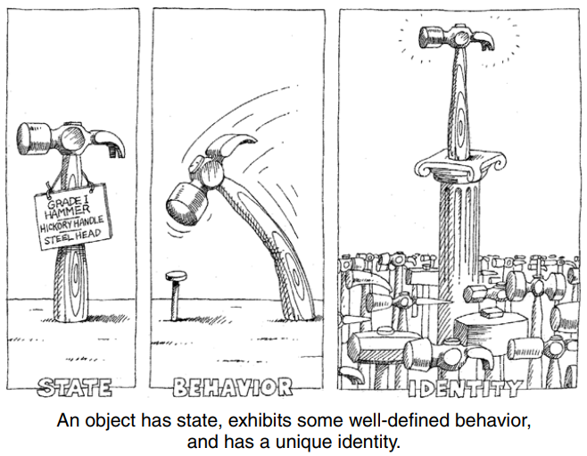
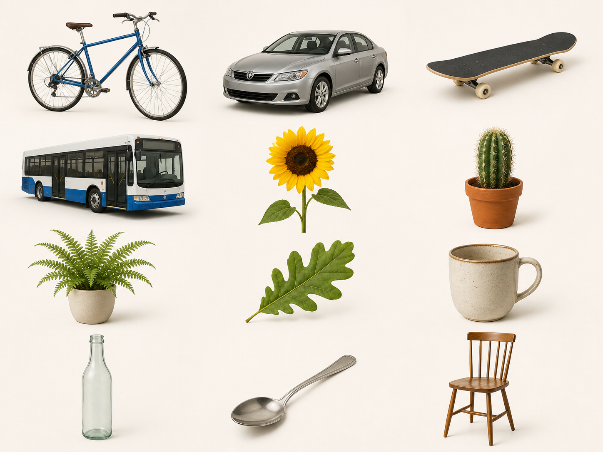

---
layout: section
index: "T"
kicker: Teoria
title: Conceitos Importantes
---

---
layout: default
hideAcademicFooter: true
---

  

---
layout: two-cols
kicker: Conceito fundamental
title: Objeto
---

Uma entidade que tem **estado**, **comportamento** e **identidade**.

::right::

---
layout: two-cols
kicker: O que o objeto sabe
title: Estado
---

Abrange todas as **propriedades estáticas** do objeto e os valores que elas possuem em determinado momento.

::right::

---
layout: two-cols
kicker: O que o objeto faz
title: Comportamento
---

É como um objeto **age e reage**, em termos de mudanças de estado e troca de mensagens.

::right::

---
layout: image
side: right
image: ../../assets/simbolos-abstracao.png
title: Abstração
---

Desconsiderar o que é obsoleto e focar no que é mais importante, de acordo com o contexto.

---
layout: section
index: "D"
kicker: Desenvolvimento
title: Hello World
---

---
layout: default
title: Ambientação
---

  

---
layout: default
title: Implementação
kicker: Objetivo
---

- Criar classes e instanciar objetos
- Definir estado e comportamento

---
layout: section
index: "H"
kicker: Hands-On
title: Criar classes e objetos com Java
---

---
layout: default
title: Atividade
---

Instancie objetos para os seguintes cenários:

- **Playlist de estudos**: adicionar música e contar músicas;

- **Pedido de delivery**: adicionar item e calcular total;
  
- **Perfil em rede social**: seguir e deixar de seguir um usuário;
  
- **Personagem de jogo**: atacar e receber ataque;
  
- **Carteira digital**: depositar e pagar.
  
---
layout: feature
kicker: Encerramento
title: Obrigado!
columns: 2
features:

- { icon: "lucide:globe", desc: filipefernandesphd.com }
- { icon: "lucide:instagram", desc: "@filipfernandesphd" }

---

---
layout: two-cols
title: Avaliação da Experiência de Aprendizagem
---
- **[Seu feedback é muito importante!](https://forms.gle/CMfL5oTm235FfuH59)**
- Obtenha o código da avaliação
::right::

