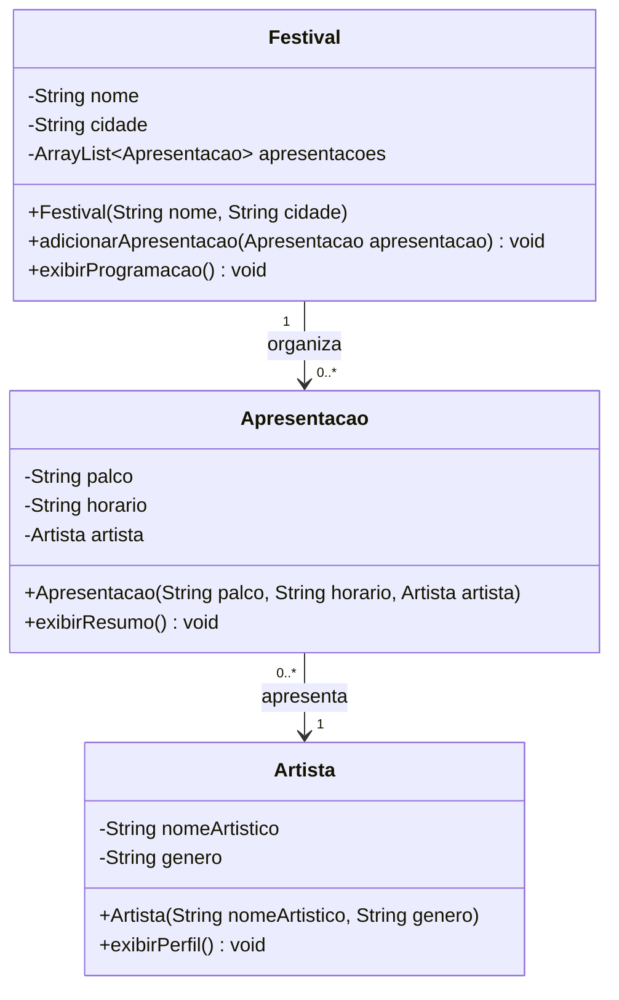
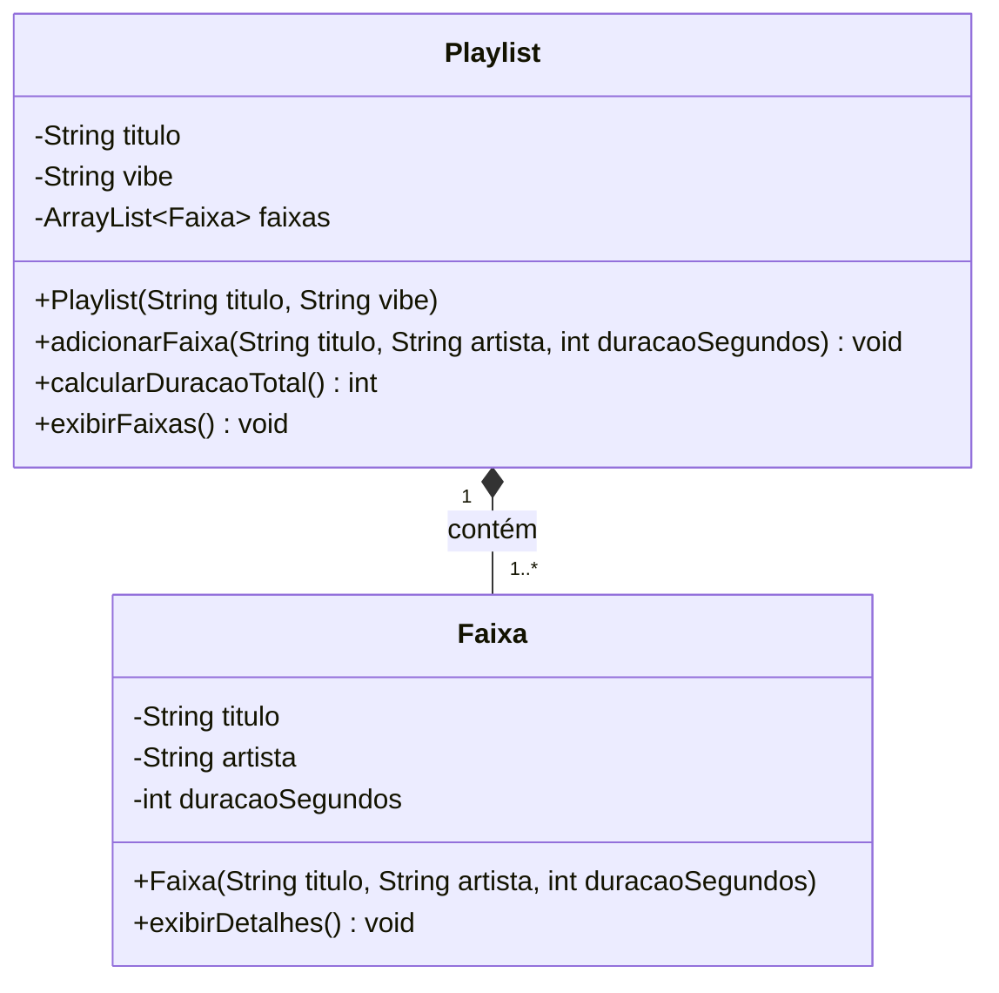
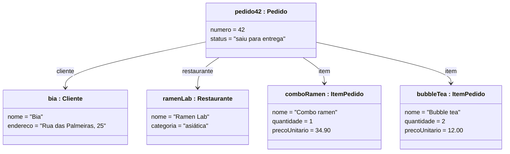
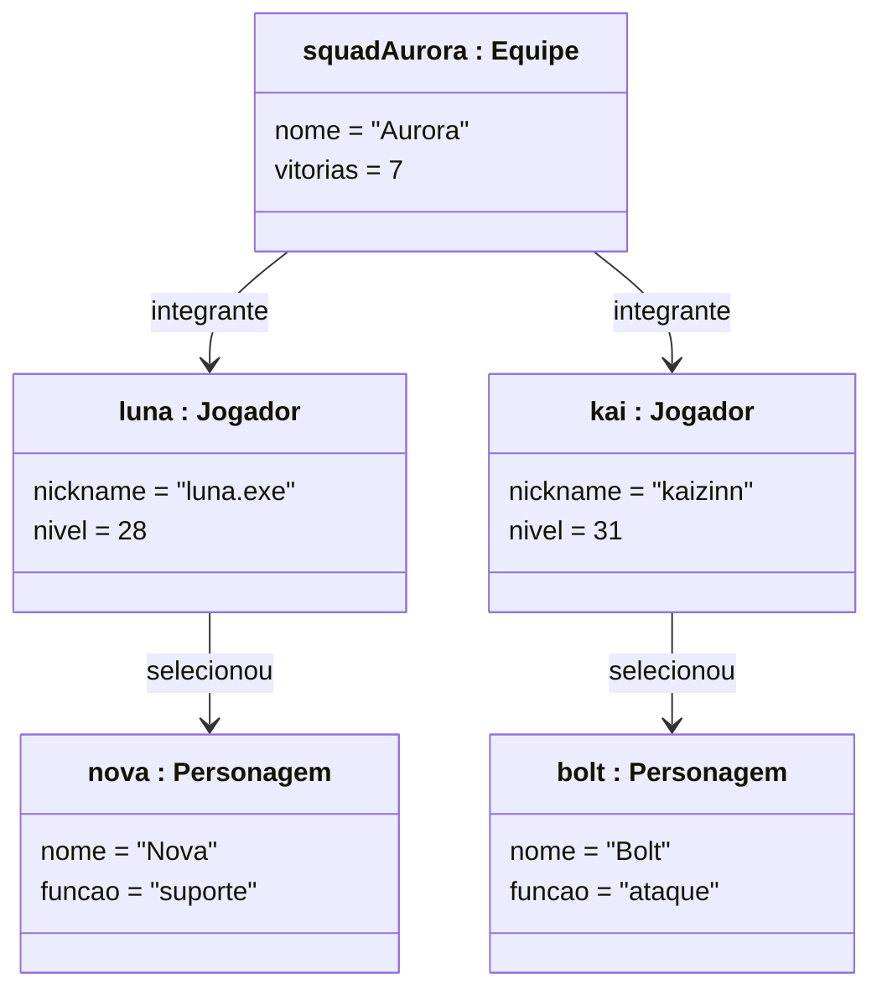

# Hands-on — Introdução à UML

Implemente em Java os quatro modelos a seguir. Em cada atividade, mantenha os
nomes, tipos, atributos, métodos e relacionamentos representados no diagrama.
Crie também uma classe `Main` que instancie os objetos, execute os métodos e
mostre no console que o modelo funciona.

> Os diagramas são o ponto de partida: decisões que não aparecem neles, como
> validações e mensagens exibidas no console, devem ser justificadas no código.

## Atividade 1 — Match no festival

Uma plataforma de festivais precisa organizar artistas e apresentações. Use o
diagrama de classes para implementar o modelo. A associação indica que um
`Festival` pode ter nenhum ou vários objetos `Apresentacao`; cada apresentação
está ligada a exatamente um artista.

Requisitos:

1. Implemente as três classes e seus construtores.
2. Não permita adicionar a mesma apresentação duas vezes ao festival.
3. Em `Main`, cadastre pelo menos dois artistas e três apresentações.
4. Exiba a programação completa, com palco, horário, artista e gênero musical.

## Atividade 2 — Playlist para cada vibe

Uma playlist agrupa faixas escolhidas para uma vibe específica. A composição
indica que as faixas pertencem à playlist neste modelo: elas devem ser criadas
e adicionadas por uma operação da própria `Playlist`.

Requisitos:

1. Implemente as duas classes e preserve a composição indicada.
2. Rejeite título vazio e duração menor ou igual a zero.
3. Converta a duração total para o formato `minutos:segundos` ao exibi-la.
4. Em `Main`, crie uma playlist com pelo menos quatro faixas e liste seu
   conteúdo e sua duração total.

## Atividade 3 — Pedido no app de delivery

O diagrama de objetos mostra uma fotografia do sistema em determinado momento.
Cada caixa representa uma instância; o texto depois de `:` informa sua classe.
A partir desse estado, deduza e implemente as classes Java necessárias.

Requisitos:

1. Crie `Pedido`, `Cliente`, `Restaurante` e `ItemPedido` com atributos e
   construtores compatíveis com os valores do diagrama.
2. Um pedido deve manter uma lista de itens e calcular o valor total.
3. Em `Main`, reproduza exatamente os cinco objetos e as ligações mostradas.
4. Exiba um resumo com número, cliente, restaurante, itens, total e status.

## Atividade 4 — Squad ranqueada

O diagrama registra uma equipe pronta para uma partida on-line. Implemente as
classes que permitem montar exatamente esse grafo de objetos e depois alterar
o estado da partida.

Requisitos:

1. Crie `Equipe`, `Jogador` e `Personagem` com atributos e construtores
   compatíveis com o diagrama.
2. A equipe deve manter seus jogadores; cada jogador pode selecionar um
   personagem por vez.
3. Em `Main`, reproduza os cinco objetos e todas as ligações mostradas.
4. Implemente uma vitória da equipe, troque o personagem de um jogador e
   mostre o estado antes e depois dessas operações.

## Entrega

Organize cada atividade em um projeto ou pacote separado. Entregue os arquivos
`.java` e um breve `README.md` informando como compilar e executar cada
solução. Não entregue apenas capturas de tela da saída.
