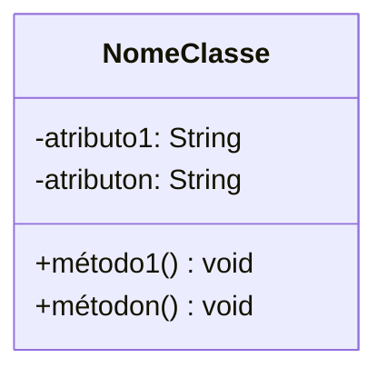
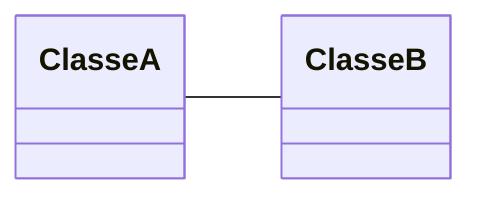
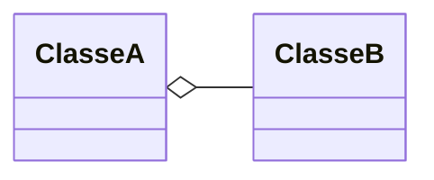
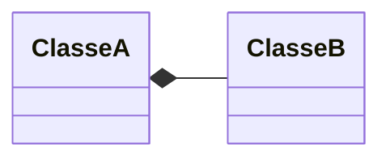
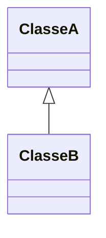
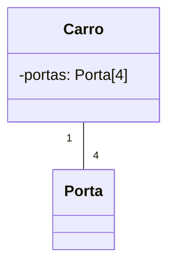
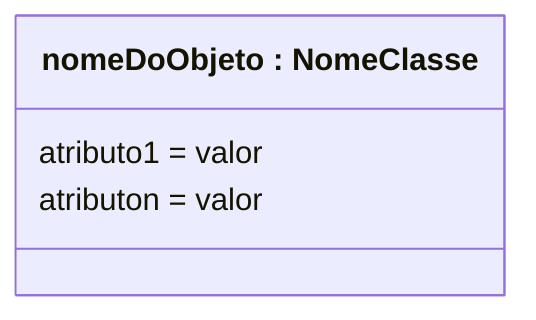
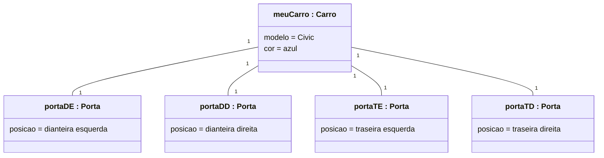

---
layout: section
index: "T"
title: Teoria
---

<!-- ---
layout: define
kicker: Definição
term: UML
definition: Uma <span class="accent2">família de notações gráficas</span>, apoiada por um metamodelo único, para descrever e projetar sistemas de software.
points:
  - Unified Modeling Language — Linguagem de Modelagem Unificada
  - Uma linguagem visual, não uma linguagem de programação
  - Síntese da definição apresentada por Martin Fowler em UML Distilled [@Fowler2003]
--- -->

---
layout: default
title: Breve história da UML
---

<v-clicks>

- **1995** — Booch e Rumbaugh publicam o Unified Method 0.8
- **1996** — Jacobson se junta aos dois autores; surge a UML 0.9
- **1997** — a OMG adota a UML 1 como padrão
- **2005** — a OMG publica a UML 2, com uma base de modelagem mais rigorosa
- **Hoje** — a UML permanece uma linguagem visual padronizada para comunicar projetos

</v-clicks>

Fonte histórica: Object Management Group [@Kobryn1999; @OMGVisualModeling].

---
layout: bleed
image: https://lh5.googleusercontent.com/t_g924hOGV9nSuNSLvXl0VcW7qzyARV6fHG9OBwl-vuIS7gUQXI_X-4ajRQydKN7OKqhZF1bu8gJnyOu4skYMiPq6YlFF5mj3zADCOJDlL4G9EnvjbhhSIV5Bd661u4gaQqe6hufk15lwQrodpxFSpA
duotone: false
---

---
layout: section
index: "01"
title: Diagrama de Classes
---

---
layout: diagram
title: Classe
---



---
layout: default
title: Relacionamentos
---

<v-clicks>

- **Associação simples** — objetos colaboram sem relação de todo e parte
- **Agregação** — a parte pode existir sem o todo
- **Composição** — a parte depende do ciclo de vida do todo
- **Herança** — uma classe especializada herda características de outra
- Realização — uma classe implementa o contrato de uma interface
- Dependência — um elemento usa outro de forma pontual

</v-clicks>

---
layout: diagram
title: Associação simples
---



---
layout: diagram
title: Agregação
---



---
layout: diagram
title: Composição
---



---
layout: diagram
title: Herança
---



---
layout: two-cols
title: Código
---



::right::

```java[font=extralarge]
class Carro {
  Porta[4] portas;
}

class Porta {

}
```

---
layout: section
index: "02"
title: Diagrama de Objetos
---

---
layout: diagram
title: Objeto
---



---
layout: diagram
title: Um carro e suas quatro portas
---



---
layout: section
index: "H"
title: Hands-on
---

---
layout: statement
kicker: Agora é com você
title: A página da aula reúne quatro atividades para transformar diagramas UML em código Java.
---

---
layout: default
title: Pratique no site da disciplina
---

- Acesse **[filipefernandesphd.github.io/DOO](https://filipefernandesphd.github.io/DOO/)**
- Abra **2026/2 → Introdução à UML → Hands-on**
- Implemente em Java o modelo apresentado em cada diagrama

<Callout icon="lucide:code-2">Dois desafios usam diagramas de classes e dois usam diagramas de objetos.</Callout>

---
layout: default
title: Referências
---
<BiblioList />

---
layout: feature
kicker: Encerramento
title: Obrigado!
columns: 2
features:

- { icon: "lucide:globe", desc: filipefernandesphd.com }
- { icon: "lucide:instagram", desc: "@filipfernandesphd" }

---

---
layout: two-cols
title: Avaliação da Experiência de Aprendizagem
---

- **[Seu feedback é muito importante!](https://forms.gle/CMfL5oTm235FfuH59)**
- Obtenha o código da avaliação

::right::


