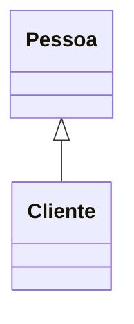
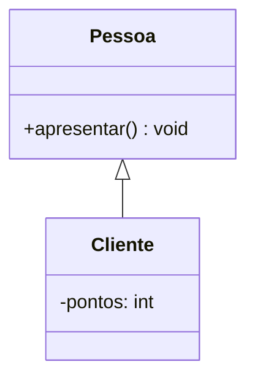
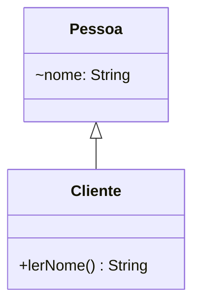
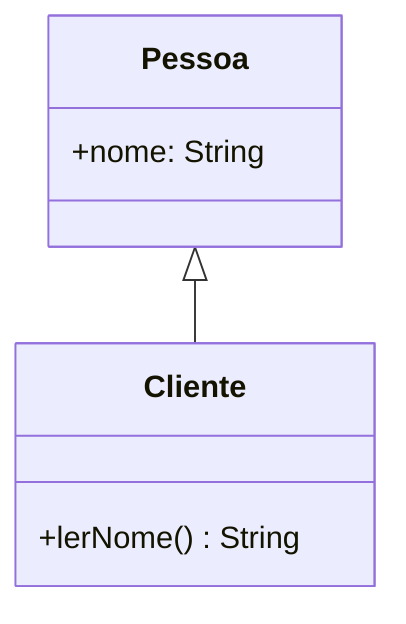
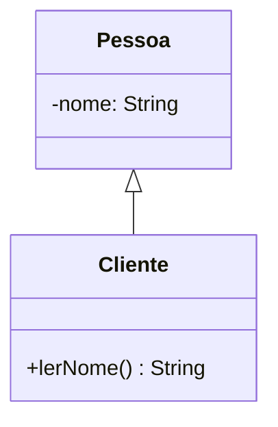
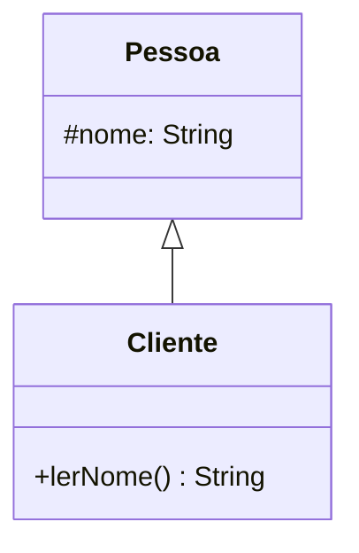
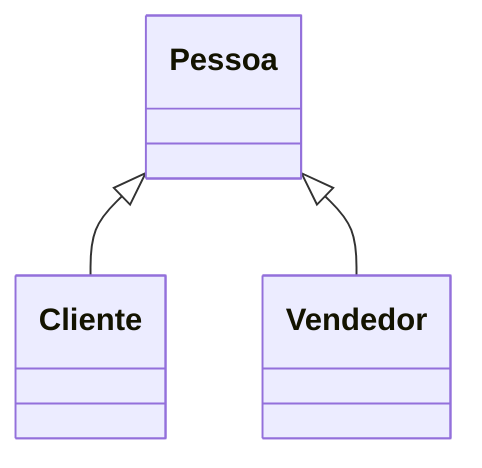

---
layout: section
index: "T"
title: "Teoria"
---

---
layout: section
title: Introdução
index: "01"
---

---
layout: default
title: Herança
---

Uma classe **especializa outra classe**, reaproveitando seus membros herdados.

Em Java, usamos `extends` para declarar essa relação.

**Exemplo:** um cliente **é um tipo** de pessoa.

---
layout: default
title: Vantagens da herança
---

- Centraliza código comum na superclasse.
- Reduz duplicação nas subclasses.
- Permite acrescentar características específicas.
- `Subclasse` reutiliza o comportamento da `Superclasse` e adiciona seu próprio comportamento.

---
layout: default
title: Limitações da herança
---

- Mudanças na superclasse podem afetar suas subclasses.
- Hierarquias profundas dificultam a manutenção.
- **Em Java, uma classe tem apenas uma superclasse direta.**
- Código parecido, por si só, não justifica herança.

---
layout: default
title: Quando existe herança?
---

Use a pergunta: **B _é um tipo_ de A?**

- `Cliente` é um tipo de `Pessoa`.
- `Carro` é um tipo de `Veiculo`.

---
layout: diagram
title: Superclasse e subclasse
---


---
layout: two-cols
title: Herança em Java
---

```java[font=large]
// Pessoa.java
public class Pessoa {
  public void apresentar() {
    System.out.println("Sou uma pessoa");
  }
}

// Cliente.java
public class Cliente extends Pessoa {
  private int pontos;
}

// Main.java
Cliente cliente = new Cliente();
cliente.apresentar();
```

::right::



---
layout: section
title: Modificadores de Acesso com Herança
index: "02"
---

<!-- ---
layout: default
title: Organização dos exemplos
---

- `Pessoa` e `Cliente` são classes públicas em arquivos separados.
- Inicialmente, ambas pertencem ao pacote `modelo`.
- `Main` pertence ao pacote `app` e não herda de `Pessoa`.

Linhas marcadas **ERRO** são tentativas que impedem a compilação. -->

---
layout: two-cols
title: Acesso default
---

Sem modificador explícito: acesso de pacote, ou **package-private**.

UML: `~` indica visibilidade de pacote.

::right::



---
layout: two-cols
title: Default no código
---

```java[font=normal]
// Pessoa.java
package modelo;
public class Pessoa {
  String nome = "Ana";
}

// Cliente.java
package modelo;
public class Cliente extends Pessoa {
  public String lerNome() {
    return nome; // OK
  }
}
```

::right::

```java[font=normal]
// Main.java
package app;
import modelo.Pessoa;
import modelo.Cliente;

public class Main {
  public static void main(String[] args) {
    Pessoa p = new Pessoa();
    System.out.println(p.nome); // ERRO

    Cliente c = new Cliente();
    System.out.println(c.lerNome()); // OK
  }
}
```

---
layout: default
title: Por que default funciona ou falha?
---

**Default permite acesso apenas dentro do mesmo pacote.**

- `Cliente` lê `nome` porque está em `modelo`.
- `Main` não acessa `p.nome` porque está em `app`.
- Se `Cliente` mudar de pacote, também perderá o acesso direto.
- Removendo a linha com erro, `Main` imprime `Ana` pelo método público.

---
layout: two-cols
title: Acesso public
---

O atributo fica acessível a outras classes, inclusive em outros pacotes.

UML: `+` indica visibilidade pública.

::right::



---
layout: two-cols
title: Public no código
---

```java[font=normal]
// Pessoa.java
package modelo;
public class Pessoa {
  public String nome = "Ana";
}

// Cliente.java
package modelo;
public class Cliente extends Pessoa {
  public String lerNome() {
    return nome; // OK
  }
}
```

::right::

```java[font=normal]
// Main.java
package app;
import modelo.Pessoa;
import modelo.Cliente;

public class Main {
  public static void main(String[] args) {
    Pessoa p = new Pessoa();
    System.out.println(p.nome); // OK
    
    Cliente c = new Cliente();
    System.out.println(c.nome); // OK
  }
}
```

---
layout: default
title: Por que public funciona?
---

**Public permite acesso onde a classe também é acessível.**

- `Cliente` herda o atributo público.
- `Main` acessa `nome` nos dois objetos e imprime `Ana` duas vezes.
- Expor atributos permite alterações sem validação. Prefira encapsulá-los.

---
layout: two-cols
title: Acesso private
---

Somente a própria classe acessa diretamente o atributo neste exemplo.

UML: `-` indica visibilidade privada.

::right::



---
layout: two-cols
title: Private no código
---

```java[font=normal]
// Pessoa.java
package modelo;
public class Pessoa {
  private String nome = "Ana";
}

// Cliente.java
package modelo;
public class Cliente extends Pessoa {
  public String lerNome() {
    return nome; // ERRO
  }
}
```

::right::

```java[font=normal]
// Main.java
package app;
import modelo.Pessoa;

public class Main {
  public static void main(String[] args) {
    Pessoa p = new Pessoa();
    System.out.println(p.nome); // ERRO
  }
}
```

---
layout: default
title: Por que private falha?
---

**Private preserva o acesso direto dentro de `Pessoa`.**

- Nem `Cliente` nem `Main` podem acessar `nome` diretamente.
- O atributo privado não é herdado por `Cliente`.
- O objeto `Cliente` mantém o estado definido por `Pessoa`.
- Um método acessível de `Pessoa` pode consultar esse estado.

---
layout: two-cols
title: Herança com encapsulamento
---

```java[font=normal]
// Pessoa.java
package modelo;
public class Pessoa {
  private String nome = "Ana";

  public String getNome() {
    return nome;
  }
}
```

::right::

```java[font=normal]
// Cliente.java
package modelo;
public class Cliente extends Pessoa {
  public String lerNome() {
    return getNome(); // OK
  }
}
```

`Cliente` herda `getNome()`.

O método acessa o atributo dentro de `Pessoa`.

---
layout: two-cols
title: Acesso protected
---

Permite acesso no mesmo pacote e, com regras específicas, em subclasses de outros pacotes.

UML: `#` indica visibilidade protegida.

::right::



---
layout: two-cols
title: Protected no código
---

```java[font=normal]
// Pessoa.java
package modelo;
public class Pessoa {
  protected String nome = "Ana";
}

// Cliente.java: outro pacote!
package clientes;
import modelo.Pessoa;
public class Cliente extends Pessoa {
  public String lerNome() {
    return this.nome; // OK
  }
}
```

::right::

```java[font=normal]
// Main.java
package app;
import modelo.Pessoa;
import clientes.Cliente;

public class Main {
  public static void main(String[] args) {
    Pessoa p = new Pessoa();
    System.out.println(p.nome); // ERRO

    Cliente c = new Cliente();
    System.out.println(c.lerNome()); // OK
  }
}
```

---
layout: default
title: Por que protected funciona ou falha?
---

**Protected permite acesso no pacote de `Pessoa` e em suas subclasses.**

- `Cliente`, em outro pacote, acessa `this.nome` por herança.
- `Main`, em `app`, não é subclasse e não acessa `p.nome`.
- Uma classe em `modelo` também acessa `nome`, mesmo sem herança.
- Removendo a linha com erro, `Main` imprime `Ana` por `lerNome()`.

---
layout: code
title: Protected em outro pacote
---

Dentro de `Cliente`, o tipo da referência também importa.

```java[font=normal]
// Método dentro de clientes.Cliente
public void comparar(Cliente outro, Pessoa pessoa) {
  System.out.println(this.nome);  // OK
  System.out.println(outro.nome); // OK
  System.out.println(pessoa.nome); // ERRO
}
```

Fora do pacote de `Pessoa`, esse acesso exige uma referência do tipo `Cliente` ou de uma subclasse de `Cliente`.

---
layout: default
title: Escolha do acesso
---

- Use `private` para preservar o estado da classe.
- Use métodos públicos para operações disponíveis aos usuários da classe.
- Reserve `protected` para membros que as subclasses precisam acessar.
- Um atributo `protected` permite que subclasses alterem seu valor diretamente.

---
layout: section
title: Desenvolvimento
index: "D"
---

---
layout: two-cols
title: Herança na concessionária
---

- Retome o projeto da **aula-03**.
- Extraia dados comuns de `Cliente` e `Vendedor` para `Pessoa`.
- Faça as adaptações necessárias ao projeto.

::right::


<!-- 
---
layout: code
title: Dados comuns em Pessoa
---

```java[font=normal]
public class Pessoa {
  private String nome;
  private String cpf;

  public Pessoa(String nome, String cpf) {
    this.nome = nome;
    this.cpf = cpf;
  }

  public String getNome() {
    return nome;
  }
}
```

`Pessoa` inicializa seus próprios atributos.

---
layout: two-cols
title: Construtores das subclasses
---

```java[font=normal]
public class Cliente extends Pessoa {
  private String endereco;

  public Cliente(String nome, String cpf,
                 String endereco) {
    super(nome, cpf);
    this.endereco = endereco;
  }
}
```

::right::

```java[font=normal]
public class Vendedor extends Pessoa {
  private double comissao;

  public Vendedor(String nome, String cpf,
                  double comissao) {
    super(nome, cpf);
    this.comissao = comissao;
  }
}
```

Construtores não são herdados. `super(...)` chama o construtor de `Pessoa`.

---
layout: default
title: Verificação da concessionária
---

- Remova os atributos comuns duplicados nas subclasses.
- Adapte a criação dos objetos aos novos construtores.
- Consulte o nome usando o método herdado `getNome()`.
- Teste uma venda com cliente e vendedor.

**Desafio:** crie um método `protected` em `Pessoa` e use-o nas duas subclasses. -->

---
layout: section
title: Hands-On
index: "H"
---

---
layout: default
title: Sistema de biblioteca
---

- Adapte o exemplo com `Livro` e `Revista` como subclasses de `Publicacao`.
- Centralize título e ano na superclasse.
- Mantenha autor em `Livro` e edição em `Revista`.
- Teste a leitura do título nos dois tipos de publicação.

---
layout: default
title: Sistema bancário
---

- Adapte `ContaCorrente` e `ContaPoupanca` para herdarem de `Conta`.
- Centralize número e saldo em `Conta`.
- Preserve o saldo como `private`.
- Ofereça um método `protected` para uma operação interna validada.
- Teste seu uso na subclasse e a rejeição do acesso por um `Main` de outro pacote.

---
layout: default
title: E-commerce
---

- Adapte `ProdutoFisico` e `ProdutoDigital` como subclasses de `Produto`.
- Centralize nome e preço.
- Mantenha peso no produto físico e link no digital.
- Use métodos herdados para consultar os dados comuns.
- Crie um objeto de cada tipo e confira sua inicialização.

---
layout: default
title: Mensagens
---

- Adapte `MensagemTexto` e `MensagemImagem` para herdarem de `Mensagem`.
- Centralize remetente e destinatário.
- Mantenha texto e caminho da imagem nas respectivas subclasses.
- Use um método `protected` para consultar um dado comum na subclasse.
- Teste o acesso dentro da subclasse e fora dela em outro pacote.

---
layout: default
title: Referências
---
<BiblioList />

---
layout: feature
kicker: Encerramento
title: Obrigado!
columns: 2
features:

- { icon: "lucide:globe", desc: filipefernandesphd.com }
- { icon: "lucide:instagram", desc: "@filipfernandesphd" }

---

---
layout: two-cols
title: Avaliação da Experiência de Aprendizagem
---

- **[Seu feedback é muito importante!](https://forms.gle/CMfL5oTm235FfuH59)**
- Obtenha o código da avaliação

::right::


