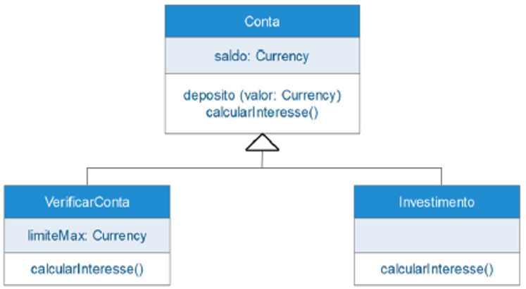

# Questão 3

A respeito do Diagrama de Classes da UML a seguir, analise as assertivas e assinale a alternativa que aponta a(s) correta(s).
 

I. O método calcularInteresse() da classe VerificarConta é abstrato sobreposto.

II. O método deposito (valor: Currency) da classe Conta é um método concreto sobreposto.

III. A classe Conta é uma classe abstrata enquanto as classes Verificacao_Conta e Investimento são concretas.

a)	Apenas I.

b)	Apenas II.

c)	Apenas III.

d)	Apenas I e II.

e)	Apenas II e III.

Gabarito: C
