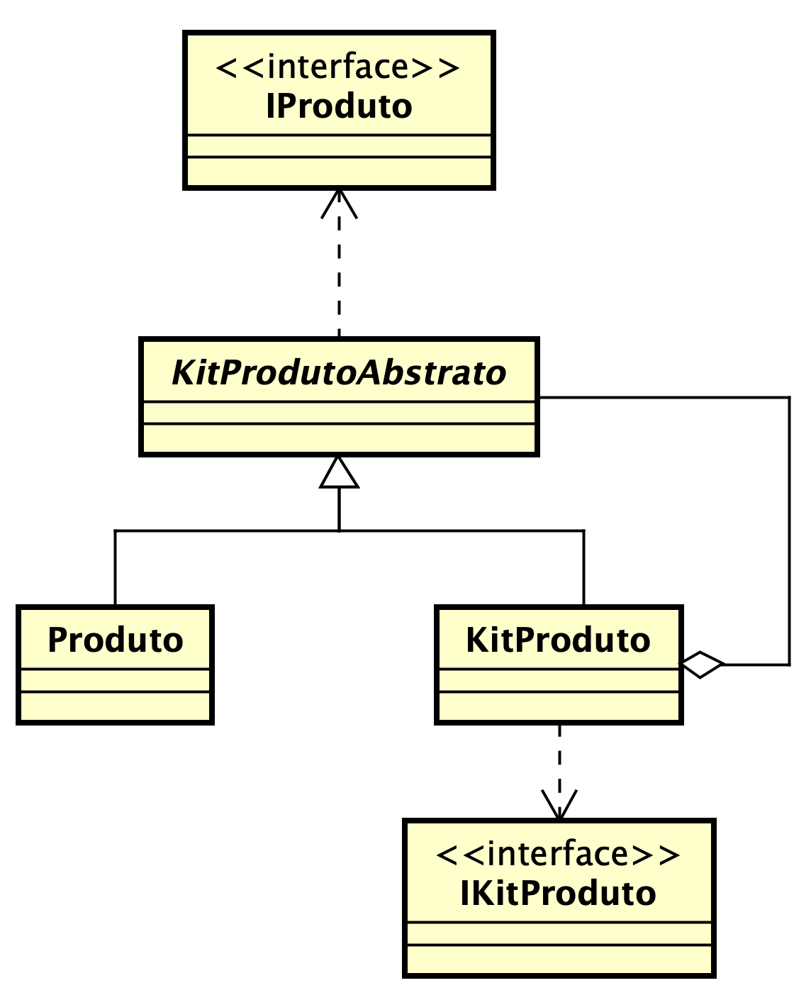

# Recuperação

## Contexto

O contexto desta prova é o desenvolvimento de uma aplicação de vendas. As operações envolvem clientes, produtos e carrinho de compras. 

## Estrutura do Projeto

```text
.vscode (configuração do VSCode)
bin (.class gerados do projeto)
doc (documentação da implementação)
lib (bibliotecas)
src (código-fonte - principal para codificação)
    br
        com
            comercio
                carrinho (implementações do carrinho)
                produto  (implementações do produto)
                usuario  (implementações do cliente)
    App.java (arquivo principal do projeto)
```

## Instruções

#### Gerais

- Baixe o projeto conforme instruções passadas pelo professor
- Renomeie a pasta do projeto para seu nome
- **Obrigatoriamente** utilize o VSCode
- **Não** mude a estrutrura de pastas e arquivos do projeto
- **Não** renomeie as pastas e arquivos do projeto
- O projeto contém todos os arquivos necessários para implementação. Porém, alguns arquivos foram corrompidos e as implementações foram perdidas. Por sorte, a pasta `doc` foi preservada com a documentação da implementação realizada. Acesse o arquivo `index.html` pelo navegador
- **Sua tarefa é: implementar estes arquivos que estão SEM codificação**
- O arquivo `App.java` **NÃO** deve ser alterado 

#### Implementação de produto

- A implementação de produto é baseada no padrão de projetos **Composite**
- Isso permite tratar kit de produtos da mesma forma de um produto individual
- `KitProduto` estende `KitProdutoAbstrato` e implementa a interface `IKitProduto`. Seu principal objetivo é criar um kit formado por um conjunto de produtos
- `Produto` estende `KitProdutoAbstrato` e implementa a interface `IKitProduto`. Seu principal objetivo é tratar um produto individualmente
- As interfaces `IProduto` e `IKitProduto` definem constratos para as classes `KitProdutoAbstrato` e `KitProduto`, respectivamente

A imagem abaixo representa a modelagem do produto e kit de produtos (caso a imagem não apareça, acesse o arquivo *diagrama_produto.png* na raiz do projeto):



#### Específicas
- O método `setPrecoProduto` da classe `KitProduto` deve gerar uma exceção. Utilize `UnsupportedOperationException`
- O método `setEstoque` da classe `KitProduto` deve gerar uma exceção. Utilize `UnsupportedOperationException`
- O método `getEstoque` da classe `KitProduto` deve gerar uma exceção. Utilize `UnsupportedOperationException`
- O método `buscarProduto` da classe `KitProduto` deve retornar `null` se não encontrar o produto

## Entrega da prova

- Salve o projeto e feche o VSCode
- Confira se a pasta do projeto é o seu nome
- Assine seu nome e coloque a data na prova
- Chame o professor para copiar o seu projeto

## Critérios de Avaliação

O valor total da prova é 10 pts.

A pontuação será verificada conforme a execução bem sucedida dos blocos de códigos definidos no arquivo `App.java`.

- **Bloco 1**: 1 pt 
- **Bloco 2**: 1 pt 
- **Bloco 3**: 2 pts
- **Bloco 4**: 1.2 pts
- **Bloco 5**: 2 pts
- **Bloco 6**: 1.2 pts 
- **Bloco 7**: 0.6 pts 
- **Bloco 8**: 1 pt 

