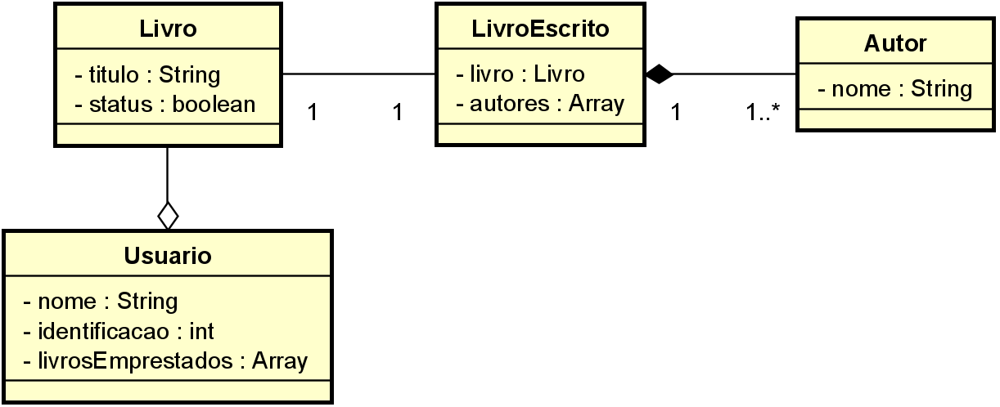

# Question 1

Crie um sistema para gerenciar uma biblioteca. Um livro tem um título, um autor e um status (disponível, emprestado). Um autor tem um nome e uma lista de livros escritos. Um usuário tem um nome, um número de identificação e uma lista de livros emprestados.

